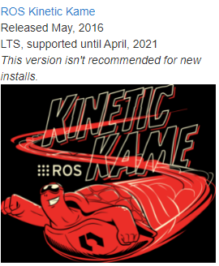

# ROS-Robot-Operating-System

# Installation on Ubuntu
**Step-1 Choose a ROS distribution**

The following ROS distributions are pretty common, but there are many others apart from these.
If you want to run two or more at a same time, you can do that as well.

[](http://wiki.ros.org/kinetic/Installation) [](http://wiki.ros.org/melodic/Installation) [](http://wiki.ros.org/noetic/Installation)

**Step-2 Select the platform as a Ubuntu**

If you choose *Noetic ROS distribution*, you will see the result like this. 
[]()


**Step-3.1 Configure your Ubuntu repositoriesu**

Configure your Ubuntu repositories to allow "restricted," "universe," and "multiverse." You can follow [the Ubuntu guide for instructions](https://help.ubuntu.com/community/Repositories/Ubuntu) on doing this.


**Step-3.2 Setup your sources.list**

Setup your computer to accept software from packages.ros.org.
```bash
sudo sh -c 'echo "deb http://packages.ros.org/ros/ubuntu $(lsb_release -sc) main" > /etc/apt/sources.list.d/ros-latest.list'
```


**Step-3.3 Set up your keys**
```bash
sudo apt-key adv --keyserver 'hkp://keyserver.ubuntu.com:80' --recv-key C1CF6E31E6BADE8868B172B4F42ED6FBAB17C654
```
If you experience issues connecting to the keyserver, you can try substituting hkp://pgp.mit.edu:80


**Step-3.4 Keep Debian package index up-to-date**
```bash
sudo apt update
```
**Step-3.5 Actual installation**
     
Desktop-Full Install: (Recommended) : Everything in Desktop plus 2D/3D simulators and 2D/3D perception packages
```bash
sudo apt install ros-noetic-desktop-full
```

OR

Desktop Install: Everything in ROS-Base plus tools like rqt and rviz.
```bash
sudo apt install ros-noetic-desktop
```

**Step-3.6 Environment setup**

You must source this script in every bash terminal you use ROS in.
```bash
source /opt/ros/noetic/setup.bash
```
You can set to automatically source this script every time a new shell is launched by following command.
```bash
echo "source /opt/ros/noetic/setup.bash" >> ~/.bashrc
source ~/.bashrc
```


**Step-3.7 Dependencies for building packages**

Up to now you have installed what you need to run the core ROS packages. To create and manage your own ROS workspaces, there are various tools and requirements that are distributed separately. For example, rosinstall is a frequently used command-line tool that enables you to easily download many source trees for ROS packages with one command.

To install this tool and other dependencies for building ROS packages, run:
```bash
sudo apt install python3-rosdep python3-rosinstall python3-rosinstall-generator python3-wstool build-essential
```
**Step-3.7.1 Initialize rosdep**

Before you can use many ROS tools, you will need to initialize rosdep. rosdep enables you to easily install system dependencies for source you want to compile and is required to run some core components in ROS. If you have not yet installed rosdep, do so as follows
```bash
sudo apt install python3-rosdep
```
With the following, you can initialize rosdep.
```bash
sudo rosdep init
rosdep update
```


